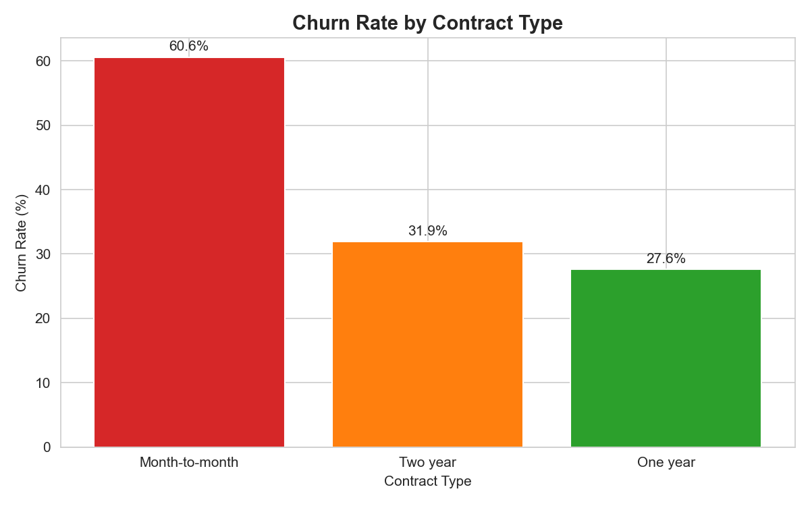
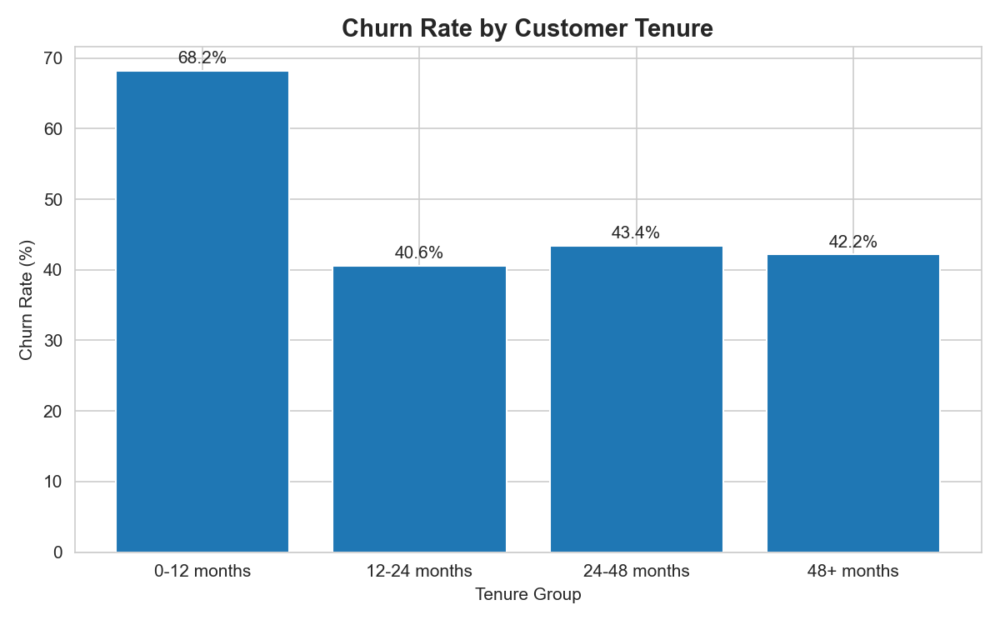
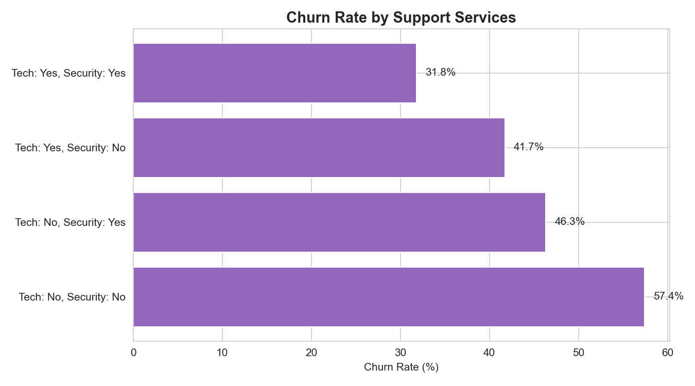
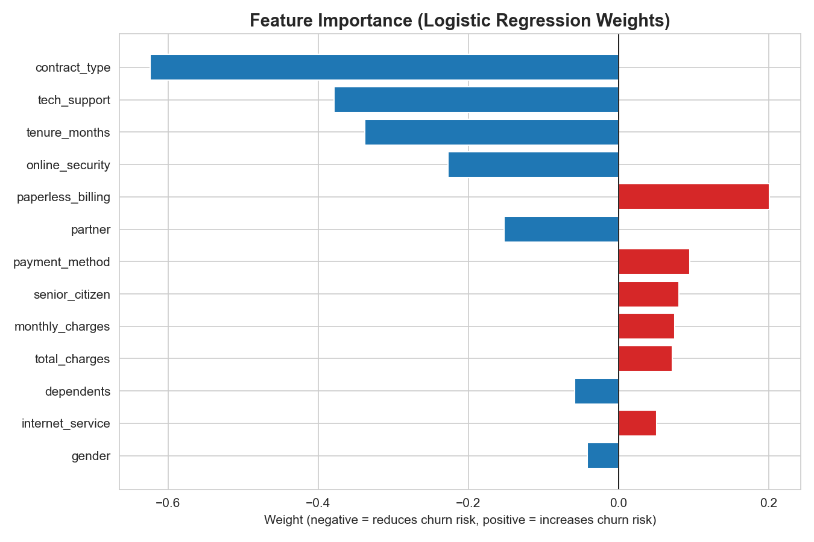

# Customer Retention & Churn Analysis

A data analysis and machine learning project that identifies why customers churn, predicts churn risk, and provides a segmented retention strategy for a subscription-based business.

## Overview

This project analyzes customer data to answer three core questions:
1. **Why** are customers leaving? (root-cause analysis)
2. **Who** is likely to leave next? (predictive model)
3. **What** should the business do about it? (retention strategy)

## Tech Stack

- **SQL (SQLite)** - data storage and root-cause exploration
- **Python** - data generation, feature engineering, modeling
- **pandas / numpy** - data manipulation
- **scikit-learn** - logistic regression churn prediction model
- **matplotlib / seaborn** - data visualization

## Dataset

A synthetic dataset of 1,000 customers was generated with realistic churn patterns based on known telecom/subscription industry drivers (contract type, tenure, support services, pricing).

## Key Findings (Root-Cause Analysis)

| Factor | Finding |
|---|---|
| **Contract Type** | Month-to-month customers churn at **60.6%**, vs 27.6–31.9% for annual contracts |
| **Tenure** | New customers (0–12 months) churn at **73.1%**, nearly 2x any other group |
| **Support Services** | Customers with no tech support and no online security churn at **57.4%**, vs 31.8% for those with both |

## Predictive Model

A logistic regression model was trained to predict churn probability for each customer.

- **Accuracy:** 57.5% (baseline random guess ≈ 50%)
- **Top predictive features:** contract type, tech support, tenure — consistent with the SQL root-cause findings

## Customer Segmentation & Retention Strategy

Customers were segmented by **churn risk** (Low / Medium / High) and **customer value** (based on monthly charges) into 6 actionable groups, each with a tailored retention strategy, from high-touch personal outreach for high-risk/high-value customers to low-cost automated offers for high-risk/low-value customers.

## Project Structure
